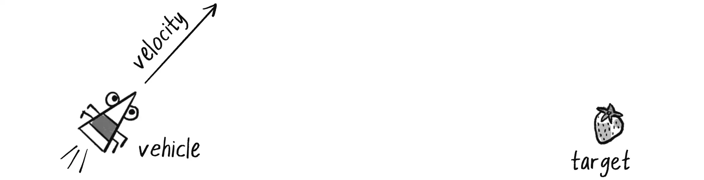
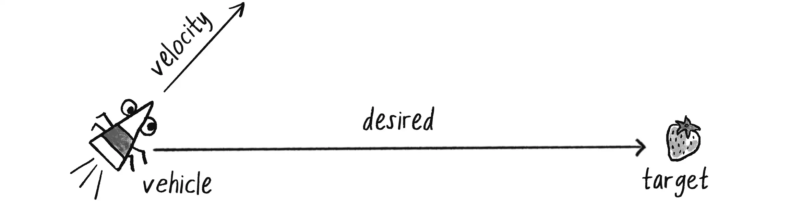
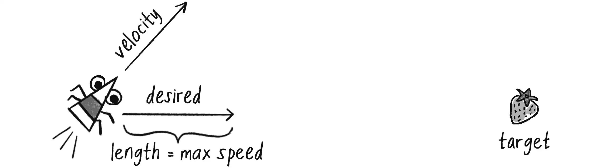
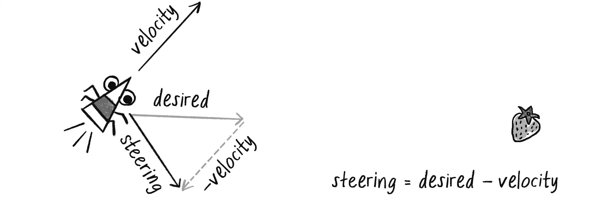
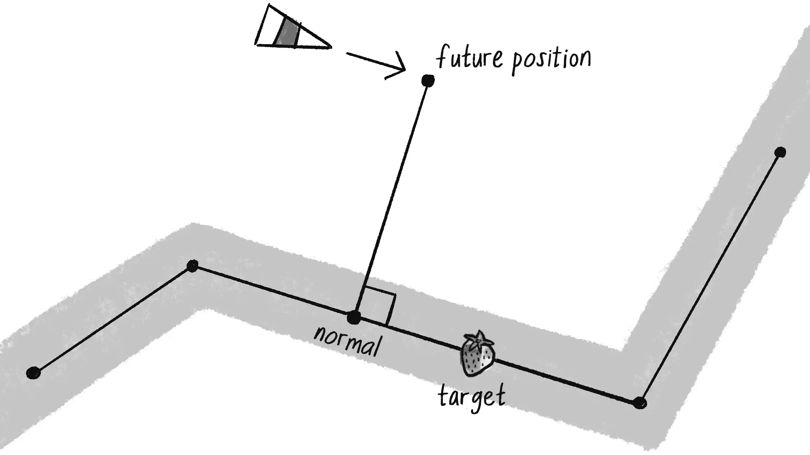
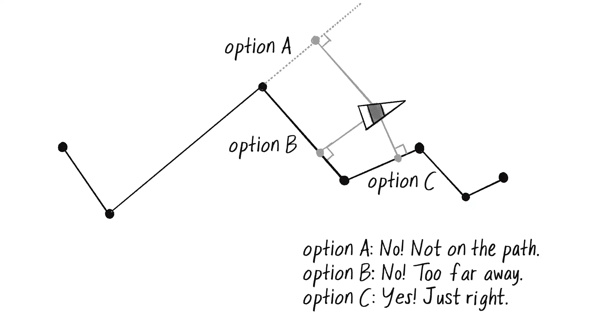

# Gegner KI 

<!-- This is a **note** -->

---
level: 2
---

# Gegner KI
Was ist passiert?
- Random Walk
- Seek, Flee, Arrive
- Follow Path, Follow Waypoints

---
level: 2
---

# Steering Behaviours
Craig Reynolds beschreibt 3 Layer
- Action Selection
- Steering
- Locomotion

---
level: 2
---

# Steering Force
Vereinfachtes Model um Steering Force zu berechnen:

$\mathbf{steeringForce} = \mathbf{desiredVelocity} - \mathbf{currentVelocity}$

---
level: 2
---

# Wie wird die Kraft zu Bewegung
2. Newtonsches Gesetz wird abgeleitet zu:

$\bf{a} = \frac{\bf{f}}{m}$

$\bf{v_{new}} = \bf{v_{old}} + \bf{a}$

---
level: 2
---

# Steering Force

<footer class="absolute bottom-0 left-0 right-0 p-2">
    <small>
        Bildquelle: <a href="https://natureofcode.com/autonomous-agents/">https://natureofcode.com/autonomous-agents/</a>
    </small>
</footer>

---
level: 2
---

## Steering Force

<footer class="absolute bottom-0 left-0 right-0 p-2">
    <small>
        Bildquelle: <a href="https://natureofcode.com/autonomous-agents/">https://natureofcode.com/autonomous-agents/</a>
    </small>
</footer>

---
level: 2
---
## Steering Force

<footer class="absolute bottom-0 left-0 right-0 p-2">
    <small>
        Bildquelle: <a href="https://natureofcode.com/autonomous-agents/">https://natureofcode.com/autonomous-agents/</a>
    </small>
</footer>

---
level: 2
---
## Steering Force

<footer class="absolute bottom-0 left-0 right-0 p-2">
    <small>
        Bildquelle: <a href="https://natureofcode.com/autonomous-agents/">https://natureofcode.com/autonomous-agents/</a>
    </small>
</footer>

---
level: 2
---

## Pfad Verfolgung

<footer class="absolute bottom-0 left-0 right-0 p-2">
    <small>
        Bildquelle: <a href="https://natureofcode.com/autonomous-agents/">https://natureofcode.com/autonomous-agents/</a>
    </small>
</footer>

---
level: 2
---

## Multi Segment Pfad

<footer class="absolute bottom-0 left-0 right-0 p-2">
    <small>
        Bildquelle: <a href="https://natureofcode.com/autonomous-agents/">https://natureofcode.com/autonomous-agents/</a>
    </small>
</footer>

---
level: 2
---

## Ausblick
